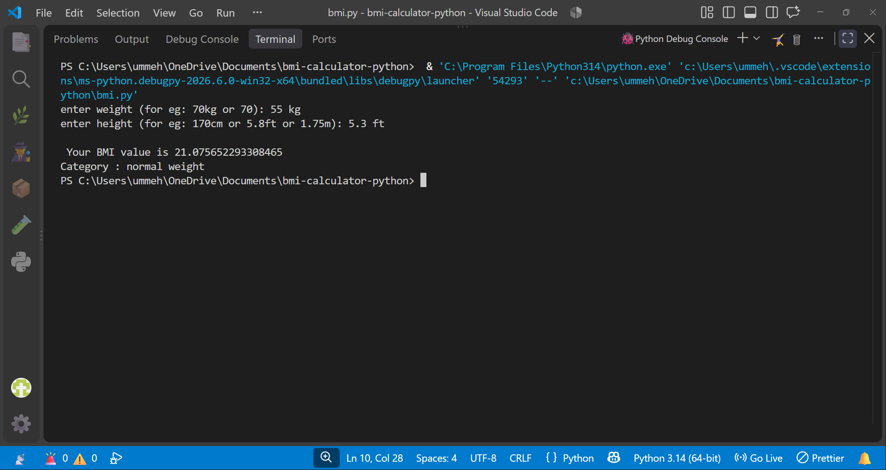

# BMI Calculator

## Demo


## Example
Input: Weight = 55 kg, Height = 5.3 ft
Output: BMI = 21.07 (Normal Weight)

## Features
- Cleans user input like "70kg", "70 kg", "70.5KG"
- Converts height from cm and feet to meters (handles 5.3ft = 5ft 3in)
- Calculates BMI and shows category (Underweight, Normal, Overweight, Obese)
- Uses modular functions and if-elif-else logic

## How to Run
```bash
python bmi.py